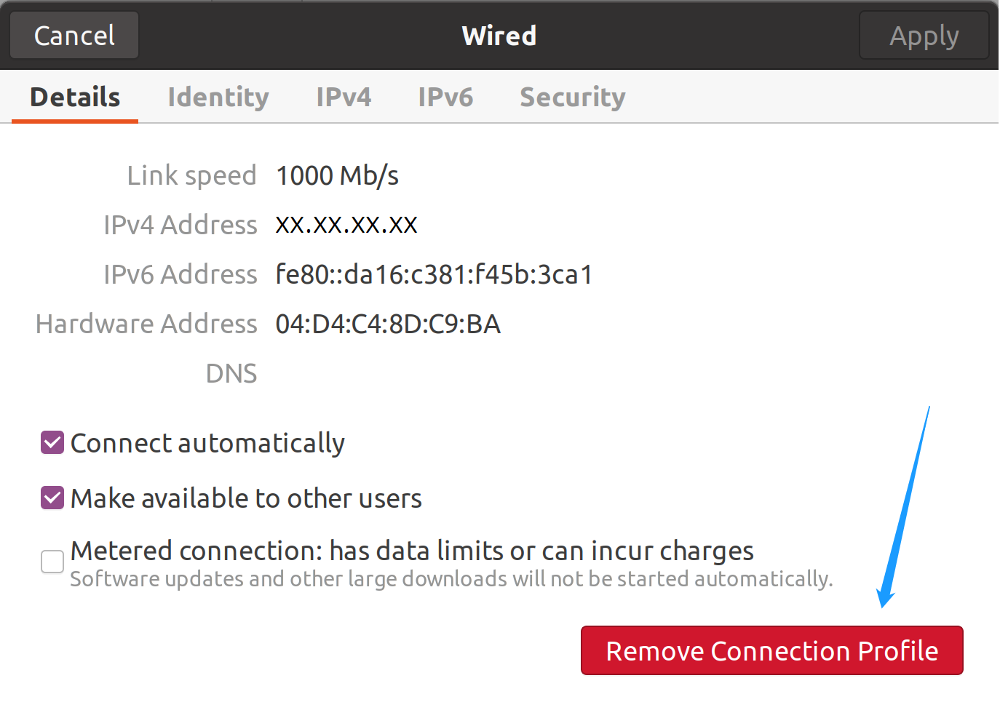
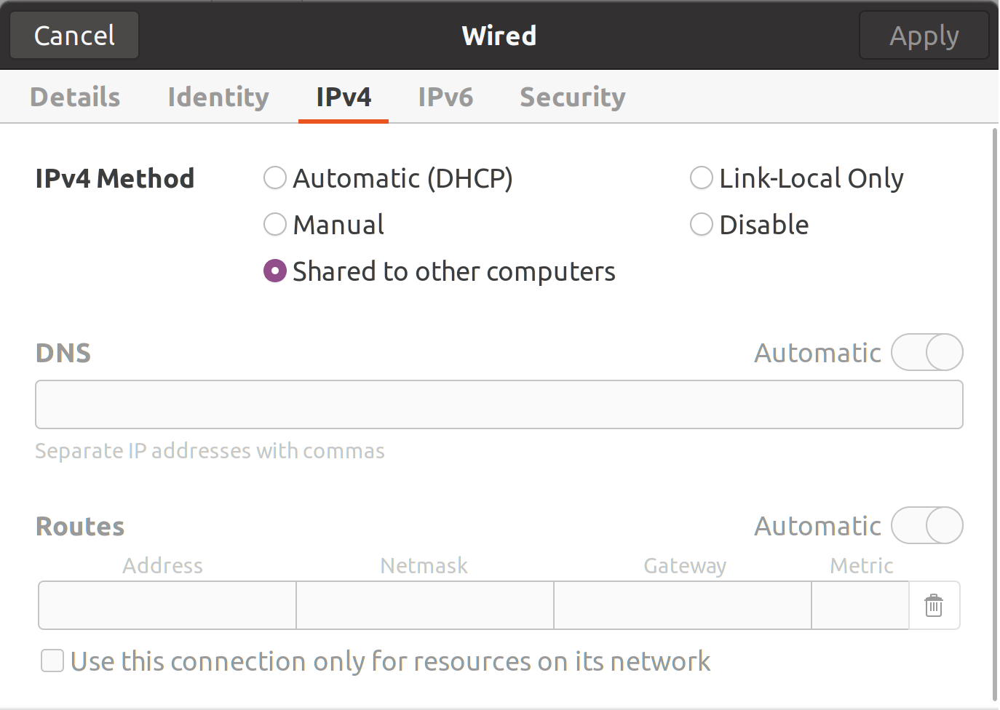
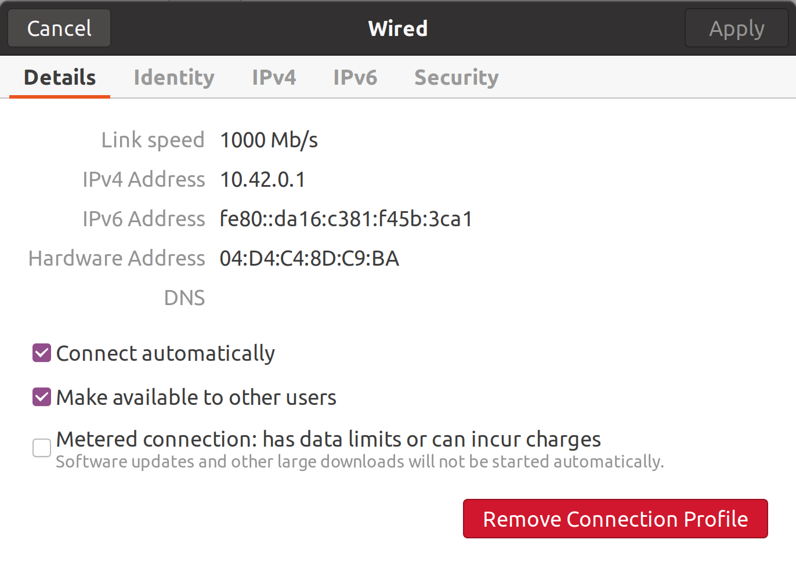

# Share Internet Connection over Ethernet Cable

Sometimes a computer does not have a wireless adapter. But another device, fortunately, is able to connect to the Internet. If you have a  ethernet cable, then the two computers can share the Internet.

## Two operating systems are Ubuntu

Suppose computer ***A*** has already connected to the Internet somehow. One end of the cable is connected to network adapter X in computer A, and the other end is connect to network adapter Y in computer B.

In computer A, open `Settings`$\rightarrow$`Network`. You need to create a new connection profile of the network adapter X: 

Or you can remove all existing connection profiles before creating a new profile:

During setting up the new profile, just choose `Shared to other computers`. You do not need to set DNS and Routes yourself. Afterward, click `Apply`.

After you reopening this profile setting, you can see the new IP address (in this example, `10.42.0.1`).

Now, it's time for setting up computer B. You need to set the IP address and DNS server manually. The IP address should in the same network segment as computer A, for example, `10.42.0.2`. Netmask can be set as `255.255.255.0`. The DNS address should be the same as computer A's IP address (in this example, `10.42.0.1`). Now, click `Apply`.

Hopefully, computer B is connected to the Internet.