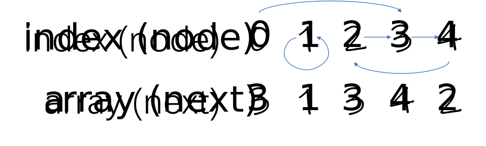

# Find the Duplicate Number

## Description

Given an array of integers `nums` containing `n + 1` integers where each integer is in the range `[1, n]` inclusive.

There is only **one repeated number** in `nums`, return *this repeated number*.

You must solve the problem **without** modifying the array `nums` and uses only constant extra space.

## Algorithms

### Binary Search

If we know the answer lies in interval `[i, j]`, which means that `nums` contains more than `(i + j + 1)` numbers in the interval. Let `mid = (i + j) / 2`. The duplicate number lies in either `[i, mid]` or `(mid, j]`.

```c++
int findDuplicate(vector<int>& nums)
{
    int left = 1, right = nums.size() - 1; // right = n;
    while (left < right)
    {
        int mid = (left + right) / 2;
        int leq = 0;
        for (const int& num: nums)
        {
            if (left <= num && num <= mid)
                ++leq;
        }
        if (leq > mid - left + 1)
            right = mid;
        else
            left = mid + 1;
    }
    return left;
}
```

###  Cycle Detection

We can view the array as a linked list. There are `(n + 1)` nodes. Node `i`'s next node is `nums[i]`. A duplicate number represents a node can be reached from two different node. Since each node can access some other node, there must be a cycle, and the duplicate number is the entry of the cycle.



How to identify the entry of a cycle in a linked list? To identify a cycle, we can use a fast pointer and a slow pointer. After they meet, initialize a new slow pointer at the head. The two slow pointer will meet at the entry of the cycle.

```c++
int findDuplicate(vector<int>& nums) {
    int fast = 0, slow = 0, third = 0;
    do
    {
        fast = nums[fast];
        fast = nums[fast];
        slow = nums[slow];
    }
    while (fast != slow);
    while (third != slow)
    {
        third = nums[third];
        slow = nums[slow];
    }
    return slow;
}
```

