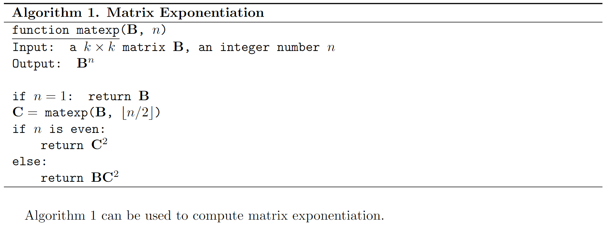

# ${\rm\LaTeX}$: Defining a new environment

Some examples are from 

[Overleaf]: https://www.overleaf.com/learn/latex/Environments#Defining_a_new_environment

## What is an environment?

Environment is a piece of text where you focus on the context instead of its format. For instance, you might insert some words in a box:

```tex
\begin{center}
    \textbf{Title}
    
    \begin{tabular}{|p{0.8\textwidth}<{\centering}|}
    	\hline
    	This is one line. \\
    	This is another line. \\
    	\hline
    \end{tabular}%
\end{center}
```


However, there many text in this format, where `Title`, `This is one line. \\` and `This is another line. \\` may be different. How can we avoid copy-and-paste? The answer is: defining a new environment.

## Defining simple environments

The new environment definition is achieved by the `\newenvironment` tag:

```tex
\newenvironment{boxed}[1]
{\begin{center}
    \textbf{#1}
    
    \begin{tabular}{|p{0.8\textwidth}<{\centering}|}
    	\hline}
    	{\hline
    \end{tabular}%
\end{center}}

```

Then the text above can be simplified as

```tex
\begin{boxed}{Title}
	This is one line. \\
	This is another line. \\
\end{boxed}
```

The regular way to define a new environment is to have `\newenvironment{environmentname}[number of args][value of optional argument]{begin code}{end code}`.

## Numbered environments

Numbered environments can be created either manually or directly with the command `\newtheorem`. These commands can also include a `\label` tag for cross reference. For example, we want to define a new environment to display an algorithm.

```tex
\newcounter{alg}
\newenvironment{Algorithm}[3]{
\refstepcounter{alg}
\begin{table}[htbp]
	\centering
    \ttfamily
    \begin{tabular}{p{\columnwidth}}
    \specialrule{0.08em}{0em}{0.1em}
    {\rmfamily \textbf{Algorithm~\thealg. #1}}\\\hline
	\ttfamily\underline{#2}#3\\}
{   \\\hline
    \end{tabular}
\end{table}}
```

We can display the **Matrix Power** algorithm as follow:

```tex
\begin{Algorithm}{Matrix Exponentiation}{function matexp}{($\mathbf{B}$, $n$)}
Input: a $k\times k$ matrix $\mathbf{B}$, an integer number $n$\\
Output: $\mathbf{B}^n$\\\\
if $n=1$: return $\mathbf{B}$\\
$\mathbf{C}=$ matexp($\mathbf{B}$, $\lfloor n/2\rfloor$)\\
if $n$ is even:\\
\qquad return $\mathbf{C}^2$\\
else:\\
\qquad return $\mathbf{B}\mathbf{C}^2$
\label{alg-matexp}
\end{Algorithm}
Algorithm \ref{alg-matexp} can be used to compute matrix exponentiation.
```


